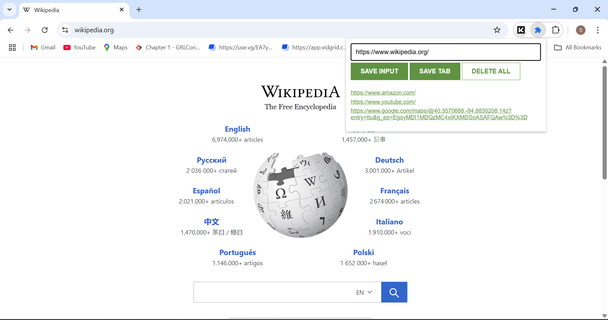

# 📌 Tabs Manager - Chrome Extension

Tabs Manager is a simple Chrome extension that lets you save website URLs either by entering them manually or with a single click on your current tab. Your saved links are stored in your browser’s local storage and persist across sessions.

---

## 🛠️ Features

- ✅ Save the current tab with **SAVE TAB**
- ✅ Manually enter and save a URL
- ✅ Double-click **DELETE ALL** to clear all saved links
- ✅ Clickable saved links open in new tabs

---

## 📂 Files Included

- `manifest.JSON` – Extension metadata and permissions  
- `index.html` – Popup layout with input, buttons, and list  
- `style.css` – Basic responsive styling  
- `index.js` – JavaScript logic for saving, rendering, and deleting tabs  
- `icon.jpeg` – Icon used in the extension popup

---

## 🧪 How to Use

1. **Download or clone** the files into a local folder.
2. Open **Chrome** and go to: `chrome://extensions/`
3. Enable **Developer Mode** (top right).
4. Click **Load unpacked** and select the folder where your files are.
5. The extension icon will appear in the toolbar.
6. Click the icon to:
   - Type a URL and click **SAVE INPUT**
   - Click **SAVE TAB** to store the current tab’s URL
   - View your saved URLs as a list of links
   - Double-click **DELETE ALL** to remove all saved URLs

---

## 🧠 Notes

- Your data is stored using `localStorage` and only accessible to you.
- This extension uses Chrome’s `tabs` API to get the current tab URL.

---

## 📸 Preview

### Popup View

### Saving a Tab

---

